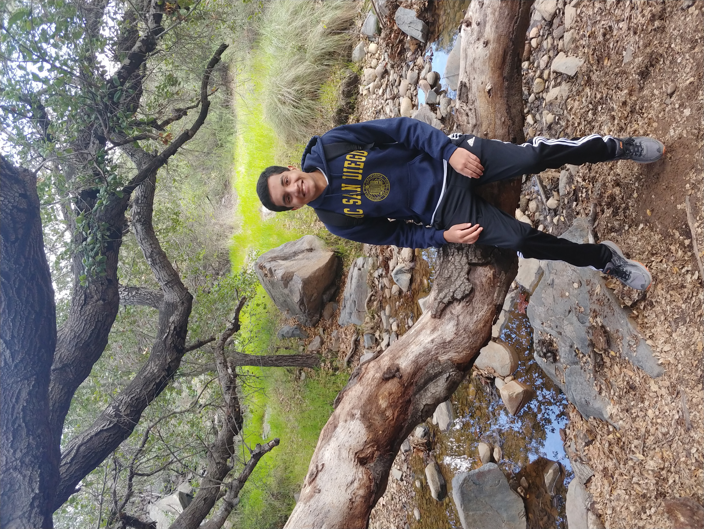

# **Table of contents**
1. About Me
2. Programming Background
3. Hobbies

<br><br>

## **About Me**

[Picture of myself](PictureOfSelf.jpg)

Hi! My name is Nakul Nandhakumar. I'm 20 years old and am currently a Sophomore. I'm majoring in Computer Engineering and planning to minor in Physics. I'm very interested in fields such as Device Physics and Quantum Computing and plan to attend graduate school in the future. I really enjoy PBL courses and have always enjoyed coding in a team, especially when the project relates to real life issues. I am looking forward to the rest of CSE 110.

<br><br>

## **Programming Background**


### Coding Languages
- [x] *```Java/Javascript``` [(Click for my favorite coding language)](README.md)*
- [x] *```Python```*
- [x] *```C/C++```*
- [x] *```Swift```*
- [x] *```ARM 32 Bit Assembly```*
- [x] *```MATLAB```*

### Previous Experience
- >Intel Validation Engineer Undergrad Intern
  - Helped maintain company-wide automation framework for running hundreds of chip performance tests, wrote many wrapper scripts in Python to handle pass/fail cases for tests run
- >Several year-long PBL high-school group projects developing webapps using SpringBoot Framework, familiar with the basics of AGILE and SCRUM methodoligies

<br><br>

## **Hobbies**
- >Tennis
  - I love being outdoors and playing sports. Tennis is something I've been playing since I was 5 years old. I still continue to play, more for fun now, and am active member of the UCSD Club Tennis Team.
- >Piano
  - I've always found that listening to music relaxes me and playing piano is one of my favorite things to do when I need to take a mental break. 
- >Carnatic Vocal Music
  - Carnatic vocal music is something that I really love and is deeply connected to my culture. Like tennis and piano, it's something that I've been learning since I was very little and I still continue to do so. [(What is Carnatic Music?)](https://en.wikipedia.org/wiki/Carnatic_music)